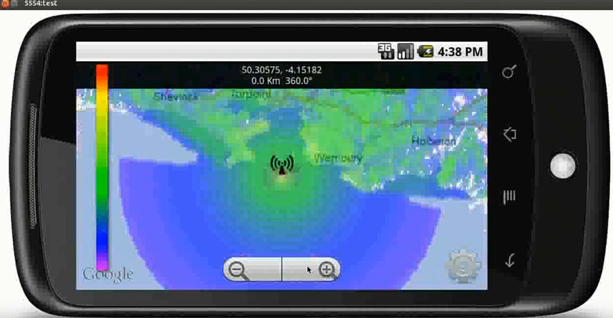
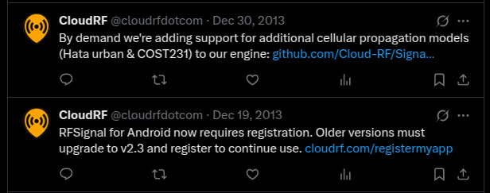
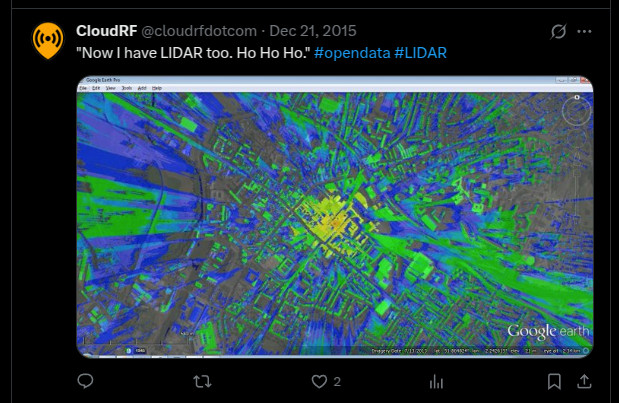
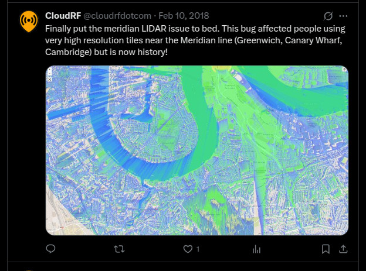
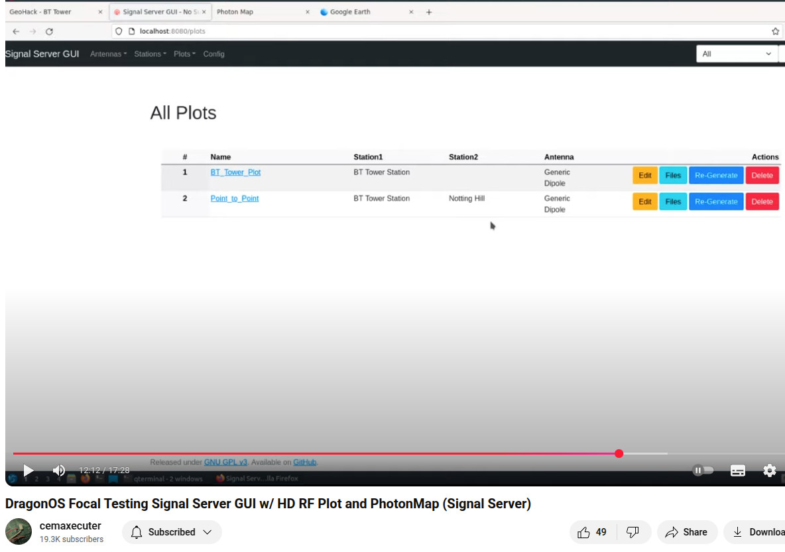
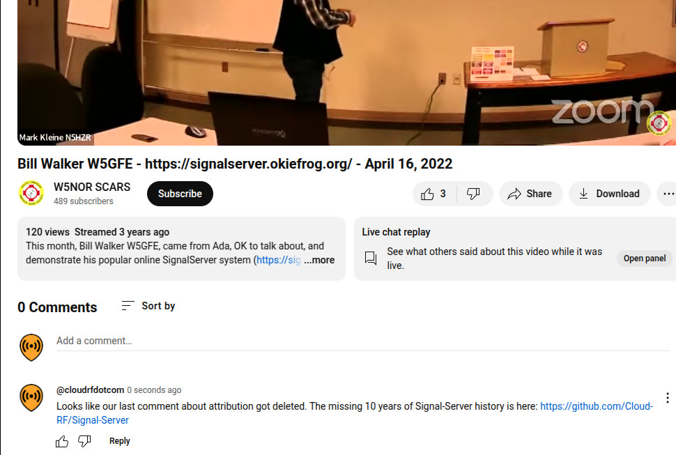

# Signal-Server

## About

This repository contains the history of Signal-Server, an open source GPLv2 RF simulation program developed and maintained by CloudRF between 2011 and 2023. 

CloudRF no longer maintains or uses this software but if you would like the source code you can get it from these forks on Github:

https://github.com/N9OZB/Signal-Server (Updated 2019, 31*)

https://github.com/W3AXL/Signal-Server (Updated 2025, 9*)

https://github.com/valderez/Signal-Server (Oldie from 2013, 6*)

## History

Signal-Server was developed in 2011 by Alex Farrant to power a hobby app called RFSignal which became CloudRF. It started as a fork of SPLAT! 1.3 which powered the first version of the app. RFSignal was retired in 2015 due to rampant piracy caused by a immature API design and a reluctance to pay Google 30% for the privilege.

## Authors

J. D. McDonald, John A. Magliacane, Sid Shumate, Alex Farrant, Gareth Evans, Michael Ramnarine, Aaron Collins

## SPLAT! 
SPLAT! was an older open source RF simulation program developed by John Magliacane, callsign KD2BD. [https://www.qsl.net/kd2bd/splat.html](https://www.qsl.net/kd2bd/splat.html)
The application featured in amateur radio publications as far back as 2005 and [2008](https://www.arrl.org/news/em-surfin-em-splat-that-path-online).

SPLAT! was a Linux command line utility which required the creation of several text files containing variables prior to execution which was a common design pattern for Linux engineering software around the millenium.

The application was based around a public domain Irregular Terrain Model (ITM) v3.0a, published by the NTIA/ITS. The model was a C++ rewrite of FORTRAN code with optimisations by J.D McDonald, John A Magliacane and Sid Shumate (2007).

    /********************************************************************************
    * ITWOM version 3.0a, January 20, 2011  File: itwom3.0a.cpp                     *
    * Provenance:   Further test version of itwom2.0m re adj to Hrzn range factors  *
    * 1. This file is based on a thorough debugging, completion, and update of the  *
    * ITM, based on an original, public domain version of this file obtained from:  *
    * ftp://flattop.its.bldrdoc.gov/itm/ITMDLL.cpp prior to May, 2007. C++ routines *
    * for this program are taken from a translation of the FORTRAN code written by  *
    * U.S. Department of Commerce NTIA/ITS Institute for Telecommunication Sciences	*
    * Irregular Terrain Model (ITM) (Longley-Rice).                                 *
    * 2. The Linux version of this file incorporates improvements suggested by a    *
    * study of changes made to file itm.cpp by J. D. McDonald to remove Microsoft   *
    * Windows dll-isms and to debug an ambguity in overloaded calls.                *
    * 3. The Linux version of this file also incorporates improvements suggested by *
    * a study of further modifications made to itm.cpp by John A. Magliacane to     *
    * remove unused variables, unneeded #includes, and to replace pow() statements 	*
    * with explicit multiplications to improve execution speed and accuracy.        *
    * 4. On August 19, 2007 this file was modified by Sid Shumate to include        *
    * changes and updates included in version 7.0 of ITMDLL.cpp, which was released *
    * by the NTIA/ITS on June 26, 2007. With correction set SS1 and SS2: itm71.cpp.	*
    * 5. On Feb. 5, 2008 this file became v.1.0 of the ITWOM with the addition, by 	*
    * Sid Shumate, of multiple corrections, the replacement of subroutines lrprop   *
    * and alos with lrprop2 and alos2, and the addition of subroutine saalos to     *
    * incorporate Radiative Transfer Engine (RTE) computations in the line of sight *
    * range.									*
    * Update 8 Jun 2010 to modify alos to match 2010 series of IEEE-BTS             *
    * newsletter articles                                                           *
    * Update June 12, 2010 to z version to change test outputs                      *
    * Offshoot start date June 23, 2010 to start itwom2.0 dual version for FCC.     *
    * Update to 2.0b July 25 to correct if statement errors in adiff2 re two peak   *
    * calculations starting at line 525                                             *
    * Development to 2.0c 8 Aug 2010 after modifying saalos and adiff for full      *
    * addition of saalos treatment to post obstruction calculations and debugging.  *
    * Modified to make 1st obs loss=5.8 only, no clutter loss considered            *
    *                                                                               *
    * Commented out unused variables and calculations to eliminate gcc warnings     *
    *    (-Wunused-but-set-variable)  -- John A. Magliacane -- July 25, 2013        *
    ********************************************************************************/

SPLAT! 1.4.0 on Github from [27th March 2012](https://github.com/jmcmellen/splat/tree/86f1cfd57bf51f9d783ea3e433e2e73dbb5a8067)

## Motive to Fork
SPLAT! was forked to make it run unattended on a server. This meant redesigning it to accept input arguments instead of text files and controlling output paths to support multiple users.

This decision was made easy with SPLAT! 1.4.0 in 2011 which included the ITWOM 3.0 model and the following Copyright statement, unusual for a community project (with a free web interface) which was promoted in radio magazines years earlier:

    * This file is copyright(c) 2011 by Sid Shumate and Givens & Bell, Inc.         *
    * All rights reserved. Commercial use, and resale, including when compiled with * 
    * wrap-around software, is prohibited except under Givens & Bell, Inc. license.	*

https://github.com/jmcmellen/splat/blob/86f1cfd57bf51f9d783ea3e433e2e73dbb5a8067/itwom3.0.cpp

This obvious GPL faux-pas was later reverted by which time Signal-Server had started, without the ITWOM model.

## First commits - 2013
The first commits included a changelog dating back to 2011 within the README which shows new command line arguments and limits for aircraft driven by app feedback. Development was irregular at this early stage as Alex was serving in the Royal Marines - and didn't know how to use Git!

    Signal Server 1.3.3 changelog 

    v1.3.3 - 04 Nov 2012
    Air planning:
    Increased maximum Tx height to 60,000 (m/f)
    Increased maximum Rx height to 60,000 (m/f)

    v1.3.2 - 04 Oct 2012
    Re-instated grey scale option to allow for terrain background.
    Off by default. Enable with switch -t

    v1.3 - 03 Jan 2012
    Added user defined clutter layers from SPLAT! (-udt switch)

    v1.2 - 31 Dec 2011
    Max colours increased from 32 to 128
    Radius value fixed at metric
    Metric / Imperial conversion bug fixed

    v1.1 - 08 Dec 2011
    Max Tx altitude increased to 20,000(m) for high altitude aircraft. "Can you 'ere me now?"
    Added 2 new options -tercon, -terdic for *custom* dielectric values and ground conductivity. -te terrain option remains. Use with care!
    New Earth Dielectric range (Permittivity): 80 to 0.1
    New Conductivity range (Siemens/m): 0.01 to 0.000001

    v1.0 - 19 November 2011
    SS released. 

Version 1.3.8 included the ITM, Hata and LOS models and could do 30m resolution.

https://github.com/valderez/Signal-Server/commits/dac9688976a7851927ed5d3c1fdf4ee8242d45f7/

Early screenshots are available on the twitter feed for @cloudrfdotcom

## Multi-threading - 2015

The primary improvement over SPLAT! was multi-threading. The first attempt at this split the circle so two threads could parallel process and the output images could be stitched later.

    -haf Halve 1 or 2 (optional)

In 2015 this was improved by a contractor, Michael, who knew how to do threads! (v2.6):

https://github.com/N9OZB/Signal-Server/commit/523cb1e7366d1043aa76d8003741fb71bf01fe00

## LiDAR - 2016

Following intense hacking by Alex during xmas holidays in 2015, LiDAR support was achieved in v2.7.
The headline was a notable **1m resolution** albeit with slow and large ASCII grid text files.

This commit, and the countless failures that led to it, was the highlight of this application's development and coincided with the publishing of public LiDAR at USGS and the UK Environment Agency. It would prove a buggy implementation but significant for urban planning:

https://github.com/N9OZB/Signal-Server/commit/a9c1916017e43dcd5d778dee77ffa0be2b0d5cd9

Best tweet ever:

## Improvements - 2016 to 2018

The two years following the LiDAR breakthrough saw a steady rate of improvements and fixes to improve the application which by now was powering CloudRF, a growing platform. A skilled developer, Gareth, was tasked to fix many design flaws relating to tile loading which highlighted fundamental problems with memory management which would limit the application's potential.

## End of the line - 2018

The commit history throughout 2018 shows clearly the frustration with repeatedly fixing the design and attempting to handle different resolution raster tiles. 

This was becoming increasingly difficult and a decision was taken to start over and design a new application, purpose built for modern CPU features and designed with diverse data sets from the outset. This became [SLEIPNIR](https://cloudrf.com/sleipnir-propagation-engine) which continues to power CloudRF today.

## Maintenance - 2018 to 2023

As soon as SLEIPNIR was mature enough to replace Signal-Server in 2019 it was swapped out at the CloudRF API. This coincided with Signal-Server forks picking up pace on Github such as Aaron / N9OZB.

Community PRs were merged to keep it up to date with features but in time, it fell behind and was no longer the leading fork on Github. Other forks introduced scripts to prepare input data and output files for different GIS systems as well as updated user interfaces which were designed for SPLAT! and updated to Signal-Server.

COVID-19 saw a spike in fork activity which resulted in new tools and interfaces.

## SignalServer web interface(s) 

In 2021, Thetacom published a modern web GUI for Signal-Server which was demonstrated to good effect by @cemaxecutor on youtube:

https://github.com/thetacom/signalserver_gui

https://www.youtube.com/watch?v=drknflEyiZ4

In 2022, the author of the 2008 SPLAT! web interface, Bill Walker W5GFE, updated his interface scripts to work with Signal Server. His SignalServer project has a hosted service and can generate KMZ files but the source is not in public version control. 

https://signalserver.okiefrog.org/

Signal-Server and the SignalServer interface are available on the popular DragonOS Linux distribution maintained by Aaron F (cemaxecuter@protonmail.com).

https://sourceforge.net/projects/dragonos-focal/

## Project closure - 2023

Signal-Server was an adventure and learning curve which served us well for six years as the primary engine behind CloudRF and delivered some intense projects including modelling every cellular network in Africa for the GSMA. 

It also featured in many online tools, which it was designed for. Some even provided attribution ;)

As CloudRF do not use it anymore, and there are more current forks on Github, a decision was taken to delete the project from Github to avoid any confusion and focus community effort onto the leading fork(s). 

Developers are encouraged to contribute to one of these forks:

https://github.com/N9OZB/Signal-Server (Updated 2019, 31*)

https://github.com/W3AXL/Signal-Server (Updated 2025, 9*)

## Thank you!

Thanks to everyone who gave feedback, opened PRs, gave accurate attribution and supported this project. 

Hopefully this chronicle of amateur to professional development and setbacks will provide hope to anyone embarking on a similar journey into the world of software development.

*"Great works are performed not by strength but by perseverance."*

Samuel Johnson 

